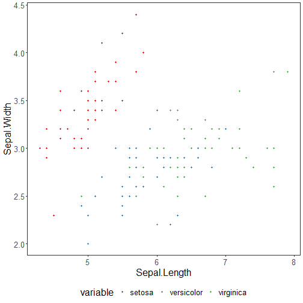
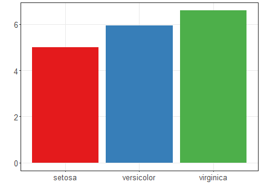
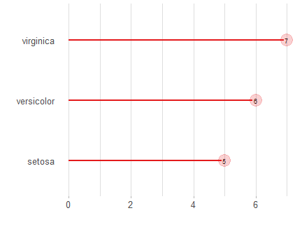
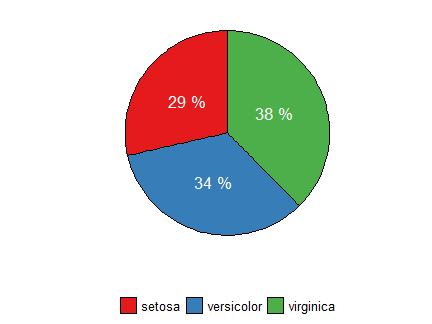
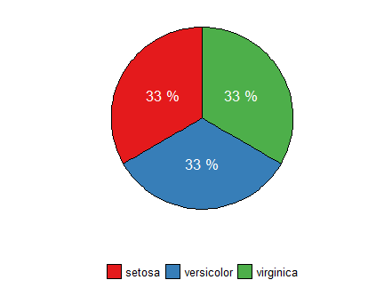
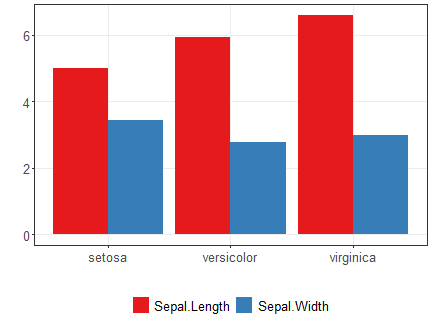
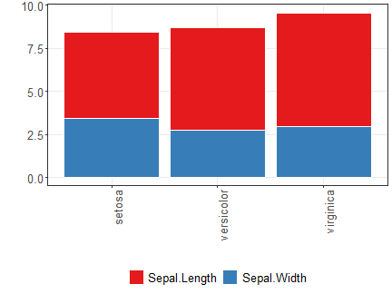
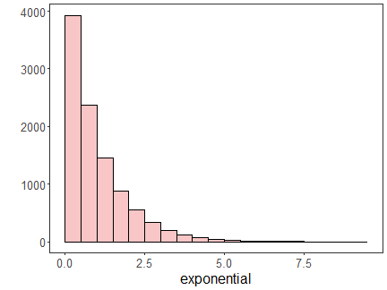
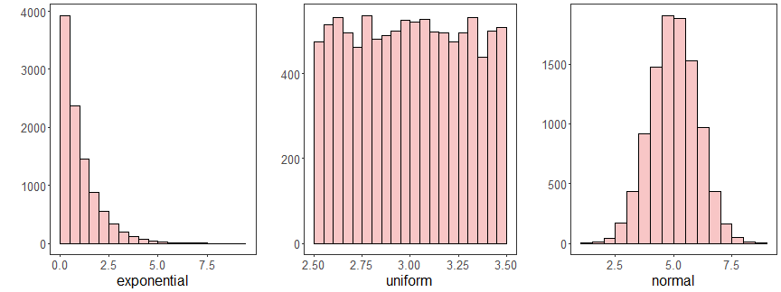

#### Plotting charts


``` r
# The easiest way to get ggplot2 is to install the whole tidyverse
#install.packages("tidyverse")
#install.packages("ggplot2")
```


#### ggplot easy encapsulation through daltoolbox


``` r
library(daltoolbox)
library(ggplot2)
```

#### Color Brewer R Package


``` r
#install.packages("RColorBrewer")
library(RColorBrewer)
colors <- brewer.pal(4, 'Set1')
```


#### Basic setup for examples

Iris datasets


``` r
head(iris, 3)
```

```
##   Sepal.Length Sepal.Width Petal.Length Petal.Width Species
## 1          5.1         3.5          1.4         0.2  setosa
## 2          4.9         3.0          1.4         0.2  setosa
## 3          4.7         3.2          1.3         0.2  setosa
```

Options from graphics: colors and font size


``` r
colors <- brewer.pal(4, 'Set1')
font <- theme(text = element_text(size=16))
```

#### Scatter plot


``` r
library(dplyr)
data <- iris |> select(x = Sepal.Length, value = Sepal.Width, variable = Species)
#head(data)
grf <- plot_scatter(data, label_x = "Sepal.Length", label_y = "Sepal.Width", colors=colors[1:3]) + font
plot(grf)
```



#### Bar plot


``` r
library(dplyr)
data <- iris |> group_by(Species) |> summarize(Sepal.Length=mean(Sepal.Length))
#head(data)
grf <- plot_bar(data, colors=colors[1:3]) + font
plot(grf)
```




#### Lollipop plot


``` r
library(dplyr)
data <- iris |> group_by(Species) |> summarize(Sepal.Length=mean(Sepal.Length))
#head(data)
grf <- plot_lollipop(data, colors=colors[1], max_value_gap=0.2) + font + coord_flip() 
plot(grf)
```



#### Bar graph with error


``` r
library(dplyr)
data <- iris |> group_by(Species) |> summarize(mean=mean(Sepal.Length), sd=sd(Sepal.Length))
#head(data)
grf <- plot_bar(data, colors=colors[1], alpha=1) + font
grf <- grf + geom_errorbar(aes(x=Species, ymin=mean-sd, ymax=mean+sd), 
                           width=0.2, colour="darkred", alpha=0.8, size=1.1) 
plot(grf)
```




#### Pie plot


``` r
library(dplyr)
data <- iris |> group_by(Species) |> summarize(n = n())
#head(data)
grf <- plot_pieplot(data, colors=colors[1:3]) + font
plot(grf)
```




#### Grouped bar


``` r
library(dplyr)
data <- iris |> group_by(Species) |> summarize(Sepal.Length=mean(Sepal.Length), Sepal.Width=mean(Sepal.Width))

#head(data)
grf <- plot_groupedbar(data, colors=colors[1:2]) + font
plot(grf)
```




#### Stacked-bar


``` r
library(dplyr)
data <- iris |> group_by(Species) |> summarize(Sepal.Length=mean(Sepal.Length), Sepal.Width=mean(Sepal.Width))

#head(data)
grf <- plot_stackedbar(data, colors=colors[1:2]) + font
grf <- grf + theme(axis.text.x = element_text(angle=90, hjust=1))
plot(grf)
```



#### Data distribution example


``` r
example <- data.frame(exponential = rexp(10000, rate = 1),
                      uniform = runif(10000, min=2.5, max = 3.5),
                      normal = rnorm(10000, mean = 5))
head(example)
```

```
##   exponential  uniform   normal
## 1   3.1545452 3.433803 4.716025
## 2   0.1710278 3.324831 5.606031
## 3   0.1940991 2.788283 3.988503
## 4   0.1896065 2.984705 3.980559
## 5   0.4751447 2.910165 5.213665
## 6   0.8023428 2.733757 6.696009
```


#### Histogram


``` r
library(dplyr)
data <- example |> select(exponential)
#head(data)
grf <- plot_hist(data, label_x = "exponential", color=colors[1]) + font
```

```
## Using  as id variables
```

``` r
plot(grf) 
```




#### Multiple Histograms


``` r
library(gridExtra)  
suppressWarnings({
grfe <- plot_hist(example |> select(exponential), label_x = "exponential", color=colors[1]) + font
grfu <- plot_hist(example |> select(uniform), label_x = "uniform", color=colors[1]) + font 
grfn <- plot_hist(example |> select(normal), label_x = "normal", color=colors[1]) + font
})
```

```
## Using  as id variables
## Using  as id variables
## Using  as id variables
```

``` r
grid.arrange(grfe, grfu, grfn, ncol=3)
```


